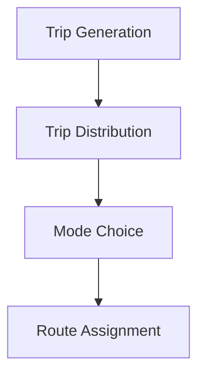
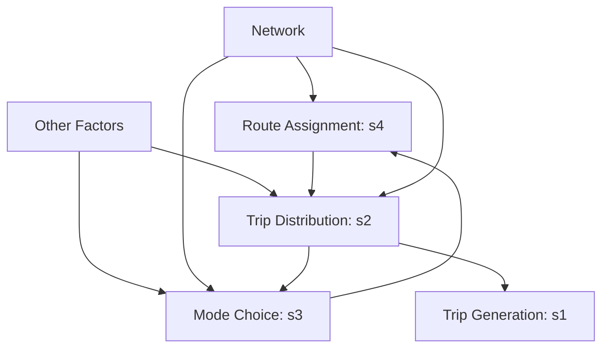
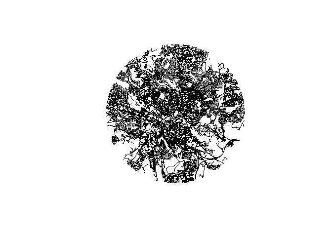
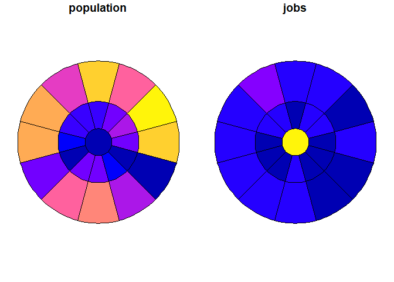
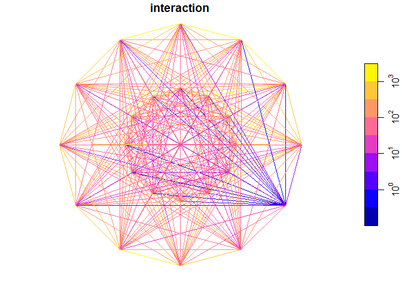
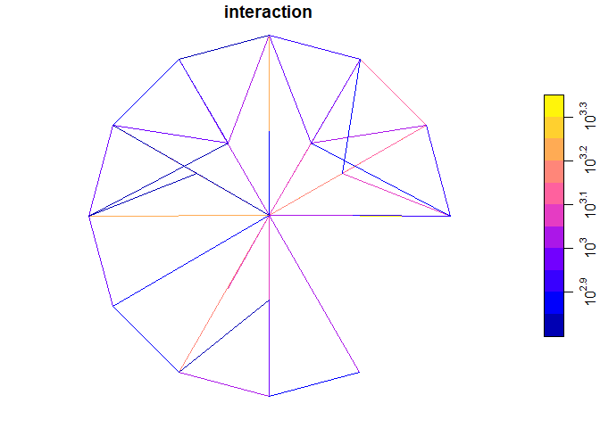
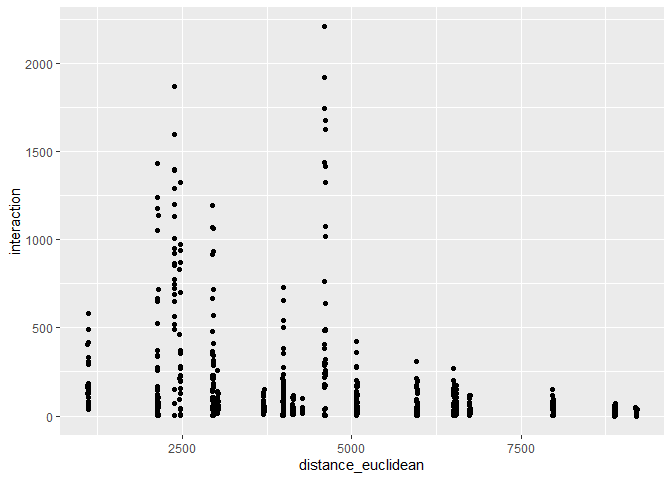

# Modelling active travel with efficient, future-proof tools
Robin Lovelace
2025-10-18

A transport models from first principles can be expressed in 4 stages,
according the classic four-step model:

1.  Trip generation: estimating the number of trips originating in and
    destined for each zone in the study area.
2.  Trip distribution: determining where trips will go, often using a
    gravity model or similar approach.
3.  Mode choice: deciding which mode of transport (e.g., car, bike,
    public transit) will be used for each trip.
4.  Route assignment: assigning trips to specific routes on

We can question the suitability of this approach, in which each stage is
treated separately and sequentially. It is clear that the number of
trips departing from a zone is not independent of where those trips are
going, the mode chosen, or the route taken: in terms of the dependencies
between these stages, one could argue that the order of the stages
should be reversed. To use the approach of setting out the dependencies
of a directed acyclic graph (DAG), the 4 stage model assumes the
following structure:

In fact, the following dependency structure may be more realistic, with
trip generation, distribution and mode choice all affected by the
network, the key input into route assignment.

This partial reversal of the order of transport modelling elements
highlights the fact that the ‘demand’ for and actual usage of transport
systems measured as the number of departures and arrivals at any given
geographic entity (Trip Generation) is not a rigid input. The number of
trips taking place is *a consequence of* the transport systems and other
factors that (dis)incentivise trips between origins and destinations
from taking place (Trip Distribution).

These observations raise the question: why did the 4-stage model come to
dominate thinking in transport modelling? It is of course impossible to
know: the decisions that led to its primacy were made many decades ago,
and intentions cannot always be inferred. However, there are various
considerations that make it understandable why the 4-stage model
presented in **?@fig-4stage** has become the starting point for
transport modelling instead of other more complicated approaches such as
the 6-stage model presented in **?@fig-6stage**. My perhaps-untestable
hypothesis is that the following reasons explain it, in descending order
of how easy they are to justify:

1.  Simplicity:
2.  Lack of data:
3.  Lack of methods:
4.  Epistemic bias: Belief in the inevitability of ‘demand’ leading to
    trips being generated due to the primacy of traditional
    microeconomics underlying much transport planning and related fields
    public decision-making.

It would be easy to criticize early transport modellers as naive.
However, anyone considering ad-hominem attacks now should remember that
they have the benefits of hindsight, plentiful datasets, an abundance of
available methods, and near-infinite computational resources compared
with early transport planning researchers and practitioners. Of course
it is now possible to consider more complex and realistic models, but
that is not the point. The question now should be how can we reform,
rebuild or *retrofit* transport modelling for the needs of the 21st
Century without losing much of what is good in the established practice
of transport modelling. In other words, we should not through the
metaphorical baby out with the bathwater.

The first of the reasons hypothesised above (simplicity) alone can, I
content, fully justify early practitioners’ development of the 4-stage,
without worrying about the other 3 reasons. This is because, as applied
mathematics text books tell us, good models start simple and then
incrementally add complexity as they go. The biggest issue with 4-stage
model is not that it exists, but that it became entrenched.

Returning to our topic of modelling active travel with efficient,
future-proof tools, these observations in fact *justify* the focus on
the 4-stage model as a starting point that can be then critiqued,
iterated-on, and then replaced with something more appropriate to
contemporary contexts (with health a more prominent priority than coping
with growth in car use, for example).

So let’s go ahead and build a transport model from first principles,
simplifying the 4-stage model further by collapsing Trip Generation and
Distribution into a single stage that can be described as Trip
Estimation (at the origin-destination level).

Figure 1: Road network data in the case study area (diameter 6 km around
Leeds city centre)

The number of trips can be estimated using spatial interaction models
using data on the number of people living in each area (and their
propensity to travel which depends on socio-economic and other
variables) and the ‘attractiveness’ of each potential destination. For
the sake of simplicity and international generalisability, we will
initially estimate the population as the number of residential buildings
in each area multiplied by 10 and the attractiveness of each destination
as the total number of OSM nodes in each. We can of course use more
refined measures such as population estimates from WorldPop but this
approach, which only requires a single input data source (OSM) for route
network and area-level variales, is used for illustrative purposes and
to increase reproducibility in new contexts.

Figure 2: Inputs to a spatial interaction model

Let’s use the datasets presented in
<a href="#fig-sim-inputs" class="quarto-xref">Figure 2</a> to run a
spatial interaction model (SIM).

     [1] "O"                      "D"                      "distance_euclidean"    
     [4] "origin_circle_id"       "origin_segment_id"      "origin_n"              
     [7] "origin_jobs"            "origin_population"      "destination_circle_id" 
    [10] "destination_segment_id" "destination_n"          "destination_jobs"      
    [13] "destination_population" "geometry"              

Note that the output has duplicate columns: `si_to_od()` joins data from
the origin and destination objects into the resulting OD object.

A simplistic SIM - in this case an inverse power distance decay function
(negative exponential is another commonly used decay function) - can be
created just based on the distance between points:

We can use ‘All or Nothing’ assignment to route the trips estimated by
the SIM through the network.

Figure 3: Estimated flows from All-or-Nothing assignment

We can do the same thing with the `dodgr` package.
